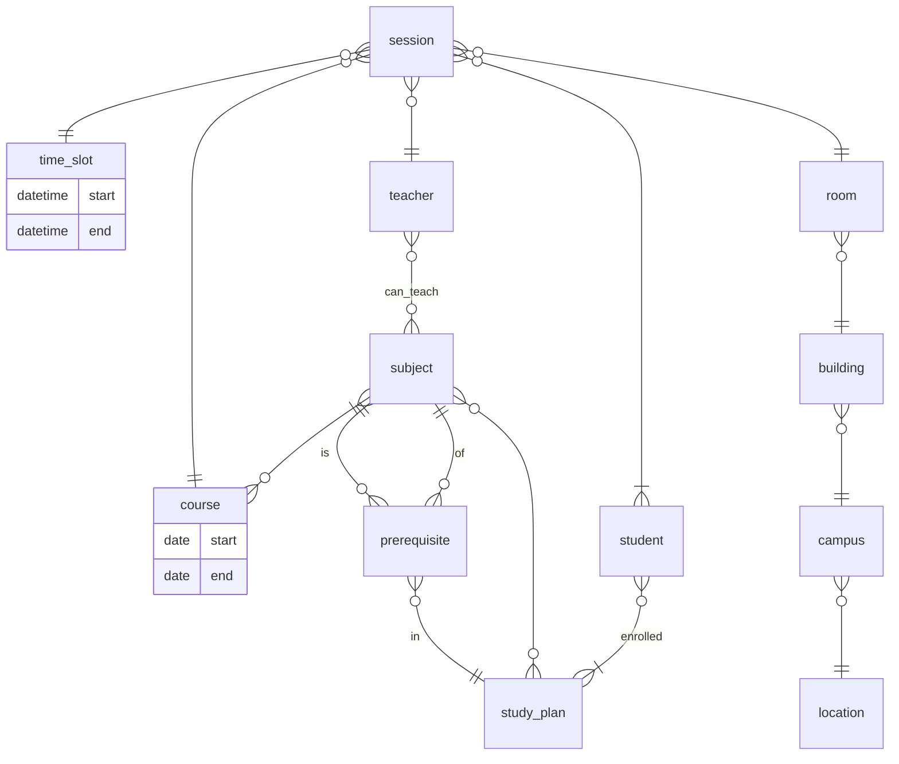

```mermaid
erDiagram
    course {
        date start
        date end
    }
    time_slot {
        datetime start
        datetime end
    }

    session }o--|| teacher : "" 
    session }o--|{ student : "" 
    session }o--|| course : ""
    session }o--|| room : ""
    session }o--|| time_slot : ""

    teacher }o--o{ subject : "can_teach"
    subject }|--o{ course : ""
    subject ||--o{ prerequisite : "is"
    prerequisite }o--|| subject : "of"
    prerequisite }o--|| study_plan : "in"
    subject }o--o{ study_plan : ""

    student }o--|{ study_plan : "enrolled"

    room }o--|| building : ""
    building }o--|| campus : ""
    campus }o--|| location : ""
```

### Notes

- Find better name for `study_plan`.
  